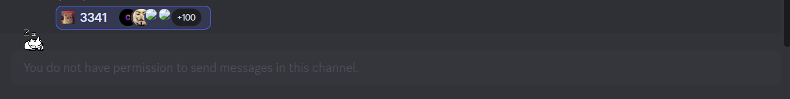
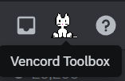

# Onekocord: Oneko for Discord!

Your favourite cat, Oneko, implemented into discord everywhere you wish

This repository contains all official Oneko skins and code snippets

Only supported on Vencord, may work on Betterdiscord

## Content
**Onekoanimations**
Onekoanimations.css is needed for all Oneko snippets. It supplies the different animations to the oneko snippets

**Onekohomeicon**
An Oneko for your home icon!


**Onekomessagebar**
Oneko on your message input!


**Onekotoolbox**
Replaces the new sleeping Oneko on the Vencordtoolbox with a custom Oneko!



## Default Variables

Here are the default variables that are used in the snippets themselves. You can copy any variable you wish to change into your Quickcss to customise your personal Oneko experience.

Valid animations are:

```css
:root { /*Onekohomeicon*/
--onekohomeicon-skin: url(https://raw.githubusercontent.com/vencordcss/onekocord/main/onekoskins/default.png);
--onekohomeicon-rendering: pixelated;
--onekohomeicon-wakeup-animation: wakeup;
--onekohomeicon-wakeup-duration: 2s;
--onekohomeicon-sleep-animation: sleep;
--onekohomeicon-sleep-duration: 2s;
--onekohomeicon-hovered-animation: runright;
--onekohomeicon-hovered-duration: 0.3s;
--onekohomeicon-selected-animation: alert;
--onekohomeicon-selected-duration: 0.3s;
}

:root { /*Onekomessagebar*/
--onekomessagebar-skin: url(https://raw.githubusercontent.com/vencordcss/onekocord/main/onekoskins/default.png);
--onekomessagebar-rendering: pixelated;
--onekomessagebar-z-index: 1;
--onekomessagebar-position-top: -30px;
--onekomessagebar-position-left: 10px;
--onekomessagebar-wakeup-animation: wakeup;
--onekomessagebar-wakeup-duration: 2s;
--onekomessagebar-sleep-animation: sleep;
--onekomessagebar-sleep-duration: 2s;
--onekomessagebar-hovered-animation: runright;
--onekomessagebar-hovered-duration: 0.3s;
--onekotoolbox-selected-animation: alert;
--onekotoolbox-selected-duration: 0.3s;
}

:root { /*Onekotoolbox*/
--onekotoolbox-skin: url(https://raw.githubusercontent.com/vencordcss/onekocord/main/onekoskins/default.png);
--onekotoolbox-rendering: pixelated;
--onekotoolbox-wakeup-animation: wakeup;
--onekotoolbox-wakeup-duration: 2s;
--onekotoolbox-sleep-animation: sleep;
--onekotoolbox-sleep-duration: 2s;
--onekotoolbox-hovered-animation: runright;
--onekotoolbox-hovered-duration: 0.3s;
--onekotoolbox-selected-animation: alert;
--onekotoolbox-selected-duration: 0.3s;
}
```